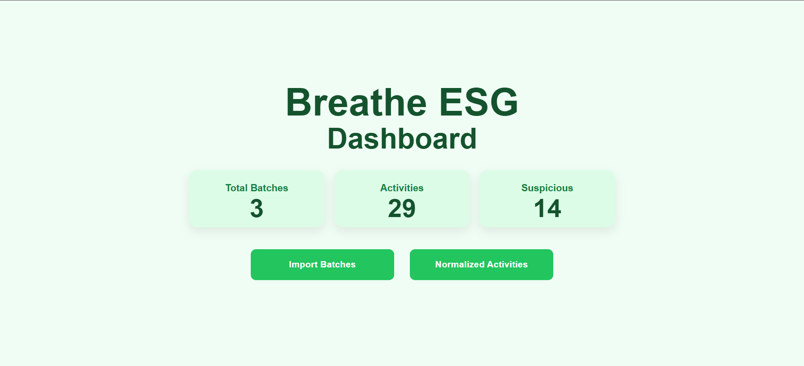
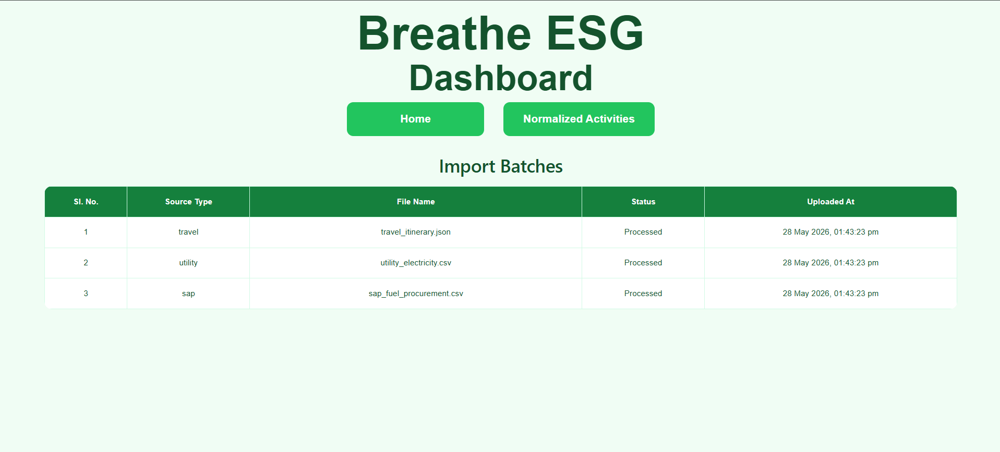
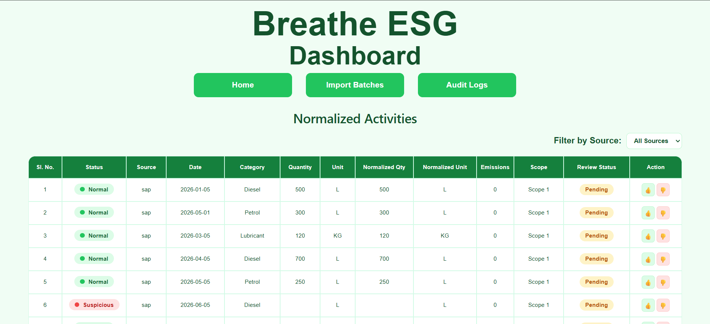
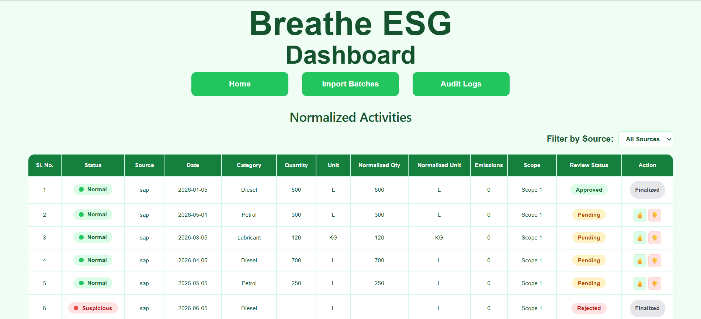
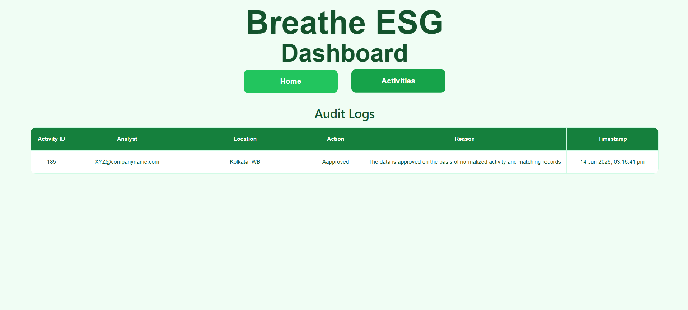

## Dashboard



## Import Batches



## Normalized Activities



## Approval/Rejection Modal



## Audit Logs



# Breathe ESG 

## Overview

This project is an ESG (Environmental, Social, and Governance) data ingestion and analytics dashboard developed as part of the Breathe ESG assignment.

The application ingests data from multiple enterprise sources, normalizes them into a unified schema, enables analyst review workflows, and maintains an audit trail for governance and traceability.

---

## Features

### Multi-Source Data Ingestion

* SAP CSV ingestion
* Utility CSV ingestion
* Travel JSON ingestion

### Data Normalization

All imported records are transformed into a common ESG activity schema containing:

* Activity Date
* Category
* Quantity
* Unit
* Normalized Quantity
* Normalized Unit
* Emissions
* ESG Scope (Scope 1/2/3)

### Suspicious Record Detection

Records are automatically flagged as suspicious when:

* Activity date is missing
* Quantity is missing
* Quantity is negative
* Quantity exceeds predefined thresholds

### Analyst Review Workflow

Analysts can:

* Approve activities
* Reject activities
* Provide reasons for decisions
* Record analyst ID and location

### Audit Logging

Every analyst action generates an audit record containing:

* Activity ID
* Analyst Email
* Analyst Location
* Action (Approved/Rejected)
* Reason
* Timestamp

---

## Tech Stack

### Frontend

* React.js
* React Router
* CSS

### Backend

* Django
* Django REST Framework

### Database

* SQLite (development)

### Deployment

* Backend: Render
* Frontend: Render Static Site

---

## Project Structure

```text
breathe-esg-assignment/
│
├── backend/
│   ├── ingestion/
│   ├── manage.py
│   └── requirements.txt
│
└── frontend/
    ├── src/
    ├── public/
    └── package.json
```

---

## Running Locally

### Backend

```bash
cd backend
pip install -r requirements.txt
python manage.py migrate
python manage.py runserver
```

### Frontend

```bash
cd frontend
npm install
npm run dev
```

---

## Deployment Links

### Backend

https://breathe-esg-assingment.onrender.com/

### Frontend

https://breathe-esg-assingment-frontend.onrender.com/

---

## Future Enhancements

The following production-grade features were intentionally left out:

* Role-based access control
* Authentication and authorization
* Real ERP integrations
* OCR-based utility bill ingestion
* Advanced emissions engine

These tradeoffs were made to prioritize core ESG workflows and auditability within the assignment scope.
